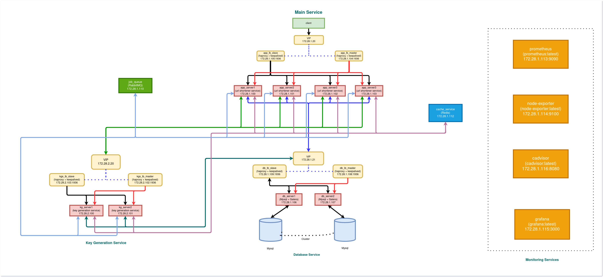

# design-url-shortener

Designing a simple URL Shortener service on Docker.

> URL Shortener service is used to short a long url, users are redirected to original url by using `Short Link`.



## Containers
```
app_server1       (Url Shortener Service)                   (172.28.1.100)
app_server2       (Url Shortener Service)                   (172.28.1.101)
app_server3       (Url Shortener Service)                   (172.28.1.102)
app_server4       (Url Shortener Service)                   (172.28.1.103)
app_lb_master     (Haproxy + Keepalived)                    (172.28.1.104:1936)     VIP:172.28.1.20
app_lb_slave      (Haproxy + Keepalived)                    (172.28.1.105:1936)     VIP:172.28.1.20
kg_server1        (Key Generation Service)                  (172.28.2.100)
kg_server2        (Key Generation Service)                  (172.28.2.101)
kg_lb_master      (Haproxy + Keepalived)                    (172.28.2.102:1936)     VIP:172.28.2.20
kg_lb_slave       (Haproxy + Keepalived)                    (172.28.2.103:1936)     VIP:172.28.2.20
db_server1        (MariaDB + Galera)                        (172.28.1.106:13306)
db_server2        (MariaDB + Galera)                        (172.28.1.107:23306)
db_lb_master      (Haproxy + Keepalived)                    (172.28.1.108:1936)     VIP:172.28.1.21
db_lb_slave       (Haproxy + Keepalived)                    (172.28.1.108:1936)     VIP:172.28.1.21
queue             (RabbitMQ)                                (172.28.1.110:5672)
cache             (Redis)                                   (172.28.1.112:6379)
prometheus        (Prometheus)                              (172.28.1.113:9090)
node-exporter     (Node Exporter)                           (172.28.1.114:9100)
cadvisor          (CAdvisor)                                (172.28.1.116:8080)
grafana           (Grafana)                                 (172.28.1.115:3000)
```
## Requirements
- [Docker](https://docs.docker.com/get-docker/)
- [Docker Compose](https://docs.docker.com/compose/install/)

## Instalation
### Clone
Cloning Url Shortener repository.
```shell
clone https://github.com/ammorteza/design-url-shortener.git
```

### Build
Build and run Url Shortener services with Docker Compose.
```shell 
docker-compose up
```
After running `docker compose up`, make sure all containers run correctly.

### Migrating Database
There are some commands for migrating `ush_db` database in `url-shortener` and `key generation` services.
Change directory to `main-service` and run bellow command. 
```
make db_migrate
```
In addition, you need to change directory to `kg-service` and run bellow commands.
```
make db_migrate
make db_seed
``` 
**Note:** Database connection info
```
database: ush_db
username: root
password: ush@1234
```
## Running
### API Endpoints
> http://172.28.1.20/create_url
```json
{
	"original_url" : "https://news.google.com/articles/CAIiEALThFPVgSrG65pjURxMo4UqGQgEKhAIACoHCAowocv1CjCSptoCMPrTpgU?hl=en-US&gl=US&ceid=US%3Aen",
	"user" : "user unique id"
}
```

> http://172.28.1.20/:unique_key
```
for example: http://172.28.1.20/giehqy 
```

### Tests
Unit tests have written for running `1000` tests on `/create_url` and `/:unique_key` APIs. For this reason, you should change directory to `main-service` and run bellow command.
```
make test
```
## Monitoring
Monitoring HAProxy stats in your browser

> main service master load balancer stats
```
http://172.28.1.104:1936/haproxy?stats
```

> main service slave load balancer stats
```
http://172.28.1.105:1936/haproxy?stats
```

> key generation service master load balancer stats
```
http://172.28.2.102:1936/haproxy?stats
```

> key generation service slave load balancer stats
```
http://172.28.2.103:1936/haproxy?stats
```

> database service master load balancer stats
```
http://172.28.1.108:1936/haproxy?stats
```

> database service slave load balancer stats
```
http://172.28.1.109:1936/haproxy?stats
```

> rabbitMQ 
```
http://172.28.1.110:15672
```

> prometheus 
```
http://172.28.1.113:9090
```

> grafana 
```
http://172.28.1.115:3000
```

**Note:** Dashboards account
```
username: admin
password: admin
```


## License

[](http://badges.mit-license.org)

- **[MIT license](https://github.com/ammorteza/design-url-shortener/blob/master/LICENSE)**
- Copyright 2020.
